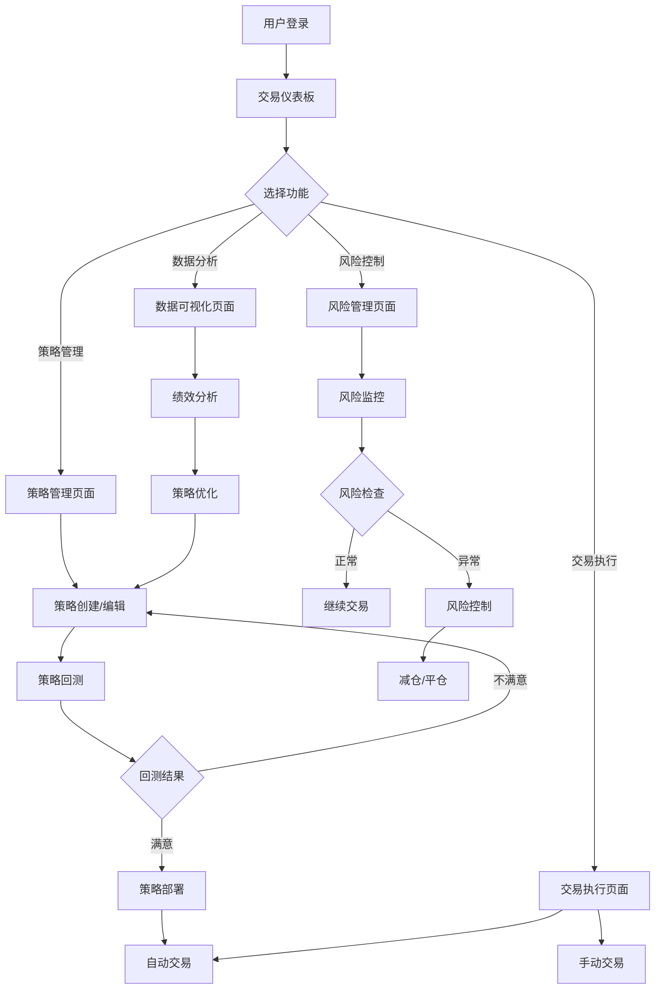

## 1. 产品概述

CryptoQuant 是一个专业的数字货币量化交易平台，集数据采集、策略开发、回测、自动交易和风险管理于一体。该平台旨在为量化交易员、数字货币投资者和金融机构提供完整的量化交易解决方案，通过自动化交易策略和风险控制机制，帮助用户在数字货币市场中获得稳定收益。

目标市场：数字货币量化交易领域，服务于专业交易员、投资机构和有经验的个人投资者。

## 2. 核心功能

### 2.1 用户角色

| 角色 | 注册方式 | 核心权限 |
|------|----------|----------|
| 普通用户 | 邮箱注册 | 查看公开策略、基础数据访问、模拟交易 |
| 高级用户 | 付费升级 | 自定义策略开发、实盘交易、高级分析工具 |
| 机构用户 | 企业认证 | 多账户管理、API接入、定制化服务 |
| 管理员 | 内部创建 | 系统管理、用户管理、数据监控 |

### 2.2 功能模块

我们的数字货币量化交易平台包含以下核心页面：

1. **交易仪表板**：实时行情展示、持仓监控、交易信号提醒
2. **策略管理**：策略创建、编辑、回测、优化和部署
3. **数据可视化**：K线图、技术指标、资金曲线、绩效分析
4. **交易执行**：手动交易、自动交易、订单管理、成交记录
5. **风险管理**：仓位控制、止损止盈、风险指标、预警设置
6. **系统配置**：交易所API配置、策略参数设置、用户偏好

### 2.3 页面详情

| 页面名称 | 模块名称 | 功能描述 |
|----------|----------|----------|
| 交易仪表板 | 实时行情 | 显示主流数字货币的实时价格、涨跌幅、成交量 |
| 交易仪表板 | 持仓监控 | 展示当前持仓情况、盈亏状态、保证金使用率 |
| 交易仪表板 | 交易信号 | 显示策略生成的买卖信号、信号强度和置信度 |
| 策略管理 | 策略列表 | 展示所有策略的基本信息、运行状态、收益率 |
| 策略管理 | 策略编辑器 | 提供策略代码编辑、语法检查、参数配置功能 |
| 策略管理 | 回测引擎 | 执行历史数据回测、生成回测报告、绩效分析 |
| 数据可视化 | K线图 | 显示价格走势、成交量、技术指标叠加 |
| 数据可视化 | 资金曲线 | 展示账户净值变化、最大回撤、收益分布 |
| 数据可视化 | 交易分析 | 显示交易记录、胜率分析、盈亏比统计 |
| 交易执行 | 手动交易 | 提供快速下单、订单类型选择、价格设置 |
| 交易执行 | 自动交易 | 策略自动执行、风控检查、异常处理 |
| 交易执行 | 订单管理 | 查看挂单、修改订单、撤销订单、成交记录 |
| 风险管理 | 仓位控制 | 设置最大仓位、杠杆倍数、资金分配 |
| 风险管理 | 止损止盈 | 配置止损止盈条件、跟踪止损、时间止损 |
| 风险管理 | 风险指标 | 计算VaR、夏普比率、最大回撤、胜率 |
| 系统配置 | API配置 | 管理交易所API密钥、测试连接、权限设置 |
| 系统配置 | 策略参数 | 配置策略运行参数、优化参数、风险控制 |
| 系统配置 | 用户偏好 | 设置界面主题、语言、通知偏好 |

## 3. 核心流程

### 3.1 策略开发流程
用户登录系统后，进入策略管理页面创建新策略，使用策略编辑器编写交易逻辑，配置策略参数，然后使用回测引擎验证策略有效性，最后部署策略到实盘环境。

### 3.2 交易执行流程
系统根据策略信号生成交易指令，经过风险管理模块检查，符合条件的订单发送到交易所执行，交易结果反馈到系统进行记录和分析。

### 3.3 风险控制流程
实时监控账户风险指标，当风险超过设定阈值时，系统自动触发风险控制措施，包括减仓、平仓、暂停交易等操作。

## 4. 用户界面设计

### 4.1 设计规范

**色彩方案**：
- 主色调：深蓝色 (#1E3A8A) - 代表专业和信任
- 辅色调：绿色 (#10B981) - 表示盈利和成功
- 警示色：红色 (#EF4444) - 表示亏损和风险
- 中性色：灰色 (#6B7280) - 用于辅助信息

**字体规范**：
- 主要字体：Inter - 现代简洁的无衬线字体
- 标题字号：24px - 28px
- 正文字号：14px - 16px
- 小字号：12px - 用于辅助信息

**布局风格**：
- 采用卡片式布局，信息层次清晰
- 左侧导航栏 + 右侧内容区域
- 响应式网格系统，支持多列布局

**图标风格**：
- 使用简洁的线性图标
- 统一使用2px线宽
- 保持视觉一致性

### 4.2 页面设计概述

| 页面名称 | 模块名称 | UI元素 |
|----------|----------|----------|
| 交易仪表板 | 行情概览 | 顶部显示主流币种价格卡片，包含24h涨跌幅、成交量，使用绿色表示上涨，红色表示下跌 |
| 交易仪表板 | 图表区域 | 主要显示K线图，支持时间周期切换（1m/5m/15m/1h/4h/1d），技术指标可叠加显示 |
| 策略管理 | 策略列表 | 表格形式展示策略信息，包含策略名称、状态、收益率、最大回撤，支持排序和筛选 |
| 策略管理 | 代码编辑器 | 使用Monaco编辑器，支持语法高亮、自动补全、错误提示，侧边栏显示策略参数配置 |
| 数据可视化 | 图表展示 | 使用Recharts库绘制专业图表，支持缩放、平移、数据点提示，图表标题清晰 |
| 交易执行 | 下单面板 | 左侧显示订单簿深度，右侧为下单表单，支持市价/限价/止损单，滑块调整杠杆 |
| 风险管理 | 风险仪表 | 圆形仪表盘显示各项风险指标，使用颜色编码风险等级，红色表示高风险 |

### 4.3 响应式设计

- **桌面优先**：主要针对1920×1080分辨率优化
- **平板适配**：支持768px以上宽度，采用折叠式导航
- **移动端**：核心功能可用，简化界面元素
- **触摸优化**：按钮最小44px，支持手势操作

## 5. 技术实现要求

### 5.1 性能要求
- 实时数据更新延迟 < 1秒
- 图表渲染响应时间 < 100ms
- 策略回测支持1年以上历史数据
- 并发用户支持1000+

### 5.2 安全要求
- API密钥加密存储（AES-256）
- 用户权限分级管理
- 操作日志完整记录
- 支持双因素认证

### 5.3 可靠性要求
- 系统可用性 > 99.9%
- 数据备份频率：每4小时
- 故障恢复时间