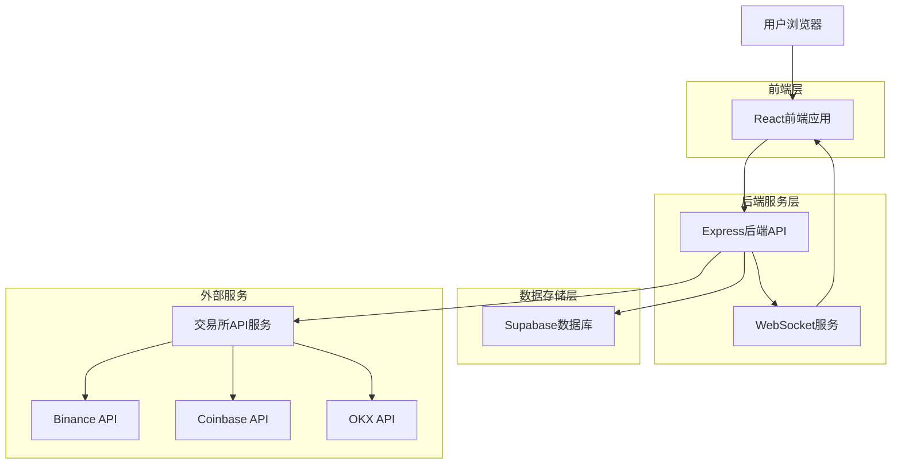
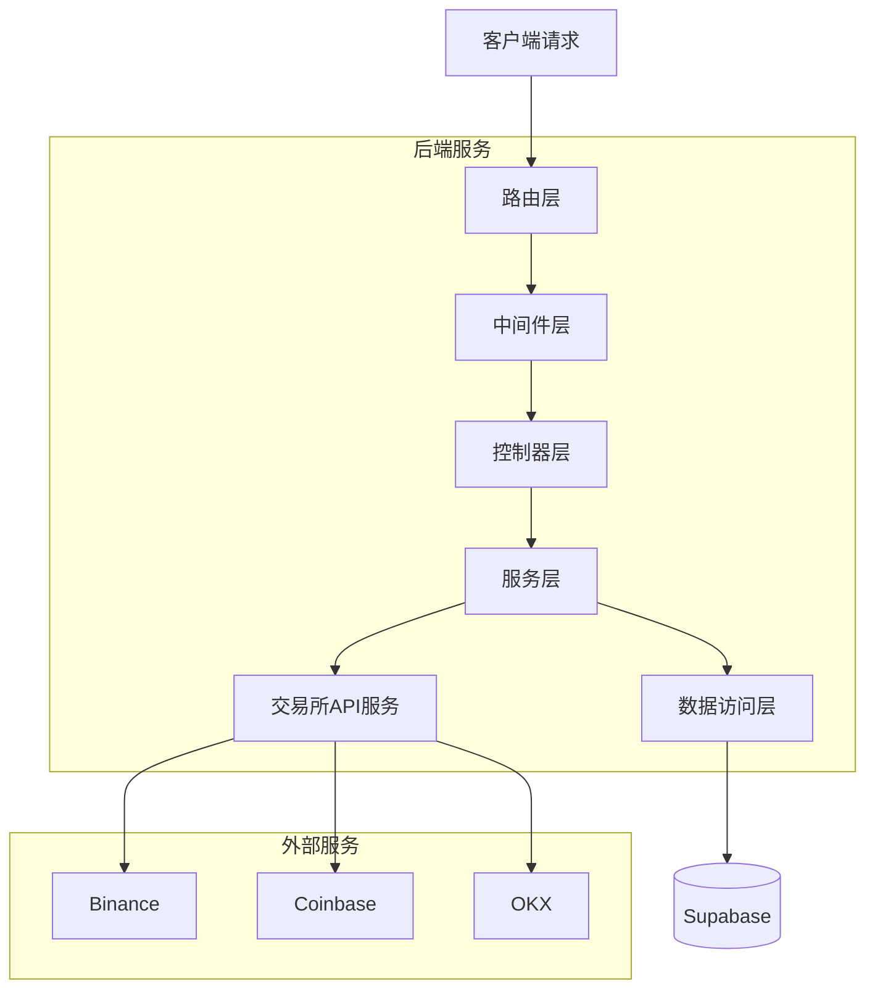
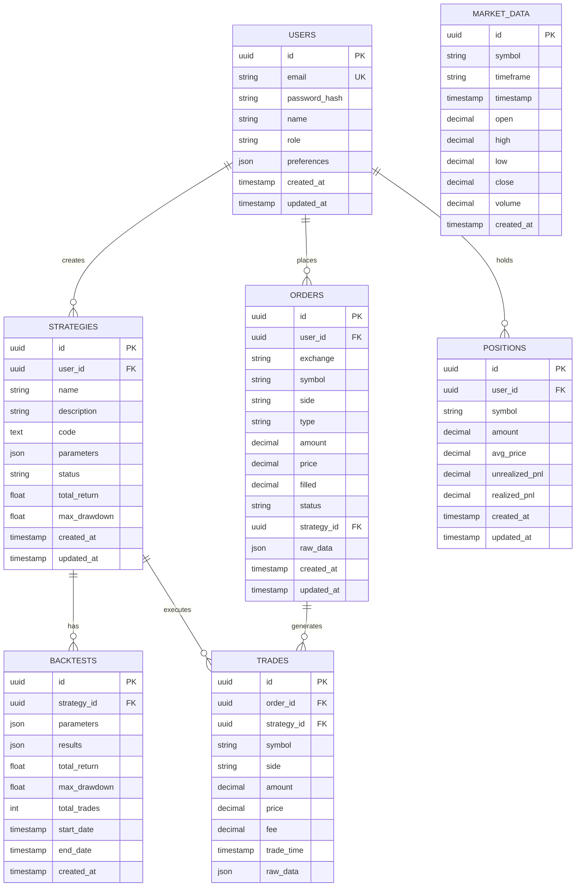

## 1. 架构设计



## 2. 技术栈描述

- **前端**: React@18 + TypeScript + Tailwind CSS + Vite
- **后端**: Node.js + Express@4 + TypeScript
- **数据库**: Supabase (PostgreSQL)
- **实时通信**: Socket.io + WebSocket
- **图表库**: Recharts + D3.js
- **交易所API**: CCXT库
- **状态管理**: Zustand
- **HTTP客户端**: Axios
- **认证**: Supabase Auth

## 3. 路由定义

| 路由 | 用途 |
|------|------|
| / | 交易仪表板主页 |
| /login | 用户登录页面 |
| /register | 用户注册页面 |
| /dashboard | 个人仪表板 |
| /strategies | 策略管理页面 |
| /strategy-editor/:id | 策略编辑器 |
| /backtest | 回测分析页面 |
| /trading | 交易执行页面 |
| /risk-management | 风险管理页面 |
| /data-visualization | 数据可视化页面 |
| /settings | 系统设置页面 |
| /api/* | API接口路由 |

## 4. API定义

### 4.1 认证相关API

```
POST /api/auth/login
```

请求参数：
| 参数名 | 类型 | 必填 | 描述 |
|--------|------|------|------|
| email | string | 是 | 用户邮箱 |
| password | string | 是 | 用户密码 |

响应：
```json
{
  "success": true,
  "data": {
    "user": {
      "id": "uuid",
      "email": "user@example.com",
      "name": "用户名",
      "role": "user"
    },
    "token": "jwt_token"
  }
}
```

### 4.2 市场数据API

```
GET /api/market/ohlcv
```

请求参数：
| 参数名 | 类型 | 必填 | 描述 |
|--------|------|------|------|
| symbol | string | 是 | 交易对，如BTC/USDT |
| timeframe | string | 是 | 时间周期，如1h、4h、1d |
| limit | number | 否 | 返回数据条数，默认100 |

响应：
```json
{
  "success": true,
  "data": [
    {
      "timestamp": 1640995200000,
      "open": 50000,
      "high": 51000,
      "low": 49500,
      "close": 50500,
      "volume": 1000
    }
  ]
}
```

### 4.3 策略管理API

```
POST /api/strategies/create
```

请求参数：
| 参数名 | 类型 | 必填 | 描述 |
|--------|------|------|------|
| name | string | 是 | 策略名称 |
| description | string | 否 | 策略描述 |
| code | string | 是 | 策略代码 |
| parameters | object | 是 | 策略参数配置 |

响应：
```json
{
  "success": true,
  "data": {
    "id": "strategy_uuid",
    "name": "策略名称",
    "status": "draft",
    "created_at": "2024-01-01T00:00:00Z"
  }
}
```

### 4.4 交易执行API

```
POST /api/trading/orders
```

请求参数：
| 参数名 | 类型 | 必填 | 描述 |
|--------|------|------|------|
| symbol | string | 是 | 交易对 |
| side | string | 是 | 买卖方向，buy/sell |
| type | string | 是 | 订单类型，market/limit/stop |
| amount | number | 是 | 交易数量 |
| price | number | 否 | 委托价格（限价单） |
| strategy_id | string | 否 | 关联策略ID |

响应：
```json
{
  "success": true,
  "data": {
    "order_id": "order_uuid",
    "status": "pending",
    "filled": 0,
    "remaining": 1.0
  }
}
```

## 5. 服务端架构设计



## 6. 数据模型

### 6.1 数据模型定义



### 6.2 数据定义语言

**用户表 (users)**
```sql
-- 创建用户表
CREATE TABLE users (
    id UUID PRIMARY KEY DEFAULT gen_random_uuid(),
    email VARCHAR(255) UNIQUE NOT NULL,
    password_hash VARCHAR(255) NOT NULL,
    name VARCHAR(100) NOT NULL,
    role VARCHAR(20) DEFAULT 'user' CHECK (role IN ('user', 'premium', 'admin')),
    preferences JSONB DEFAULT '{}',
    created_at TIMESTAMP WITH TIME ZONE DEFAULT NOW(),
    updated_at TIMESTAMP WITH TIME ZONE DEFAULT NOW()
);

-- 创建索引
CREATE INDEX idx_users_email ON users(email);
CREATE INDEX idx_users_role ON users(role);
```

**策略表 (strategies)**
```sql
-- 创建策略表
CREATE TABLE strategies (
    id UUID PRIMARY KEY DEFAULT gen_random_uuid(),
    user_id UUID NOT NULL REFERENCES users(id) ON DELETE CASCADE,
    name VARCHAR(100) NOT NULL,
    description TEXT,
    code TEXT NOT NULL,
    parameters JSONB DEFAULT '{}',
    status VARCHAR(20) DEFAULT 'draft' CHECK (status IN ('draft', 'active', 'paused', 'archived')),
    total_return DECIMAL(10, 4) DEFAULT 0,
    max_drawdown DECIMAL(10, 4) DEFAULT 0,
    created_at TIMESTAMP WITH TIME ZONE DEFAULT NOW(),
    updated_at TIMESTAMP WITH TIME ZONE DEFAULT NOW()
);

-- 创建索引
CREATE INDEX idx_strategies_user_id ON strategies(user_id);
CREATE INDEX idx_strategies_status ON strategies(status);
```

**订单表 (orders)**
```sql
-- 创建订单表
CREATE TABLE orders (
    id UUID PRIMARY KEY DEFAULT gen_random_uuid(),
    user_id UUID NOT NULL REFERENCES users(id) ON DELETE CASCADE,
    strategy_id UUID REFERENCES strategies(id) ON DELETE SET NULL,
    exchange VARCHAR(50) NOT NULL,
    symbol VARCHAR(20) NOT NULL,
    side VARCHAR(10) NOT NULL CHECK (side IN ('buy', 'sell')),
    type VARCHAR(20) NOT NULL CHECK (type IN ('market', 'limit', 'stop', 'stop_limit')),
    amount DECIMAL(20, 8) NOT NULL,
    price DECIMAL(20, 8),
    filled DECIMAL(20, 8) DEFAULT 0,
    remaining DECIMAL(20, 8) DEFAULT 0,
    status VARCHAR(20) DEFAULT 'pending' CHECK (status IN ('pending', 'open', 'closed', 'canceled', 'expired')),
    raw_data JSONB DEFAULT '{}',
    created_at TIMESTAMP WITH TIME ZONE DEFAULT NOW(),
    updated_at TIMESTAMP WITH TIME ZONE DEFAULT NOW()
);

-- 创建索引
CREATE INDEX idx_orders_user_id ON orders(user_id);
CREATE INDEX idx_orders_strategy_id ON orders(strategy_id);
CREATE INDEX idx_orders_symbol ON orders(symbol);
CREATE INDEX idx_orders_status ON orders(status);
CREATE INDEX idx_orders_created_at ON orders(created_at DESC);
```

**市场数据表 (market_data)**
```sql
-- 创建市场数据表
CREATE TABLE market_data (
    id UUID PRIMARY KEY DEFAULT gen_random_uuid(),
    symbol VARCHAR(20) NOT NULL,
    timeframe VARCHAR(10) NOT NULL,
    timestamp TIMESTAMP WITH TIME ZONE NOT NULL,
    open DECIMAL(20, 8) NOT NULL,
    high DECIMAL(20, 8) NOT NULL,
    low DECIMAL(20, 8) NOT NULL,
    close DECIMAL(20, 8) NOT NULL,
    volume DECIMAL(20, 8) NOT NULL,
    created_at TIMESTAMP WITH TIME ZONE DEFAULT NOW(),
    UNIQUE(symbol, timeframe, timestamp)
);

-- 创建索引
CREATE INDEX idx_market_data_symbol ON market_data(symbol);
CREATE INDEX idx_market_data_timeframe ON market_data(timeframe);
CREATE INDEX idx_market_data_timestamp ON market_data(timestamp DESC);
CREATE INDEX idx_market_data_symbol_timeframe ON market_data(symbol, timeframe);
```

### 6.3 权限配置

```sql
-- 授予匿名用户基本查询权限
GRANT SELECT ON market_data TO anon;

-- 授予认证用户完整权限
GRANT ALL PRIVILEGES ON users TO authenticated;
GRANT ALL PRIVILEGES ON strategies TO authenticated;
GRANT ALL PRIVILEGES ON orders TO authenticated;
GRANT ALL PRIVILEGES ON trades TO authenticated;
GRANT ALL PRIVILEGES ON positions TO authenticated;
GRANT ALL PRIVILEGES ON backtests TO authenticated;

-- 创建RLS策略（行级安全）
ALTER TABLE strategies ENABLE ROW LEVEL SECURITY;
ALTER TABLE orders ENABLE ROW LEVEL SECURITY;
ALTER TABLE positions ENABLE ROW LEVEL SECURITY;

-- 策略表RLS策略
CREATE POLICY "用户只能查看自己的策略" ON strategies
    FOR ALL TO authenticated
    USING (auth.uid() = user_id);

-- 订单表RLS策略
CREATE POLICY "用户只能查看自己的订单" ON orders
    FOR ALL TO authenticated
    USING (auth.uid() = user_id);
```

## 7. 部署架构

### 7.1 开发环境
- **前端**: Vite开发服务器，支持热重载
- **后端**: Node.js + nodemon，支持自动重启
- **数据库**: SQLite本地数据库
- **缓存**: 内存缓存

### 7.2 生产环境
- **前端**: 静态文件部署到CDN
- **后端**: Docker容器化部署
- **数据库**: Supabase PostgreSQL
- **缓存**: Redis集群
- **负载均衡**: Nginx反向代理
- **监控**: Prometheus + Grafana

### 7.3 环境变量配置
```bash
# 数据库配置
SUPABASE_URL=your_supabase_url
SUPABASE_ANON_KEY=your_supabase_anon_key
SUPABASE_SERVICE_KEY=your_supabase_service_key

# 交易所API配置
BINANCE_API_KEY=your_binance_api_key
BINANCE_SECRET_KEY=your_binance_secret
COINBASE_API_KEY=your_coinbase_api_key
COINBASE_SECRET_KEY=your_coinbase_secret

# JWT配置
JWT_SECRET=your_jwt_secret_key
JWT_EXPIRES_IN=24h

# 应用配置
NODE_ENV=production
PORT=3000
CORS_ORIGIN=https://yourdomain.com
```

## 8. 监控和日志

### 8.1 性能监控
- API响应时间监控
- 数据库查询性能监控
- 内存和CPU使用率监控
- 交易延迟监控

### 8.2 业务监控
- 策略收益率统计
- 交易成功率监控
- 风险指标预警
- 系统异常告警

### 8.3 日志管理
- 用户操作日志
- 策略执行日志